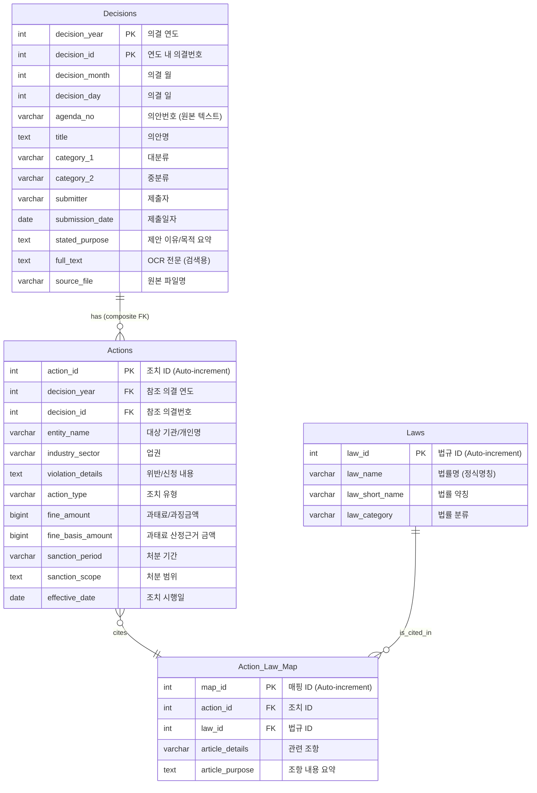

**"통합 시스템 설계 명세서(Integrated System Design Specification)"**

규제 인텔리전스 플랫폼: PoC 시스템 설계 명세서 (v1.0)
1. 프로젝트 개요 및 목표
1.1. 프로젝트명
규제 인텔리전스 플랫폼 (Regulatory Intelligence Platform) - Proof of Concept

1.2. 목표
금융위원회 의결서 데이터를 수집, 분석, 구조화하여 자연어 질의를 통해 복합적인 규제 동향 및 제재 사례를 분석할 수 있는 웹 기반 시스템의 핵심 기능(PoC)을 개발한다.

1.3. 핵심 요구사항
초기 데이터 적재: 지정된 기간의 금융위 의결서 원본(PDF)을 수집하여 구조화된 데이터로 변환 후 DB에 1회 적재한다.
AI 기반 데이터화: Google Gemini Pro API를 활용하여 PDF 문서의 내용을 분석하고, 사전 정의된 스키마에 따라 데이터를 추출 및 분류한다.
AI 기반 데이터 검증: 인간 전문가의 검수 과정을 'AI 검수 에이전트'로 대체하여 데이터의 논리적/맥락적 타당성을 검증한다.
복합적 NL2SQL: 자연어 질문을 이해하여 복잡한 SQL 쿼리로 변환하고, 그 결과를 사용자에게 제공하는 기능을 구현한다.
2. 데이터베이스 설계 (v2.0 - 복합키 아키텍처)
2.1. ERD (Entity-Relationship Diagram)

content_copy
download
Use code with caution.
Mermaid
2.2. 테이블별 상세 명세 및 분류 기준
<details>
<summary><strong>Table 1: Decisions - 상세 명세</strong></summary>
컬럼명	데이터 타입	제약조건	설명 및 분류 기준
decision_id	INTEGER	PK	의안 ID. 의안번호(agenda_no)에서 숫자 부분만 추출하여 사용. 예: "제 200 호" -> 200
agenda_no	VARCHAR(50)	NOT NULL	의안번호 원본 텍스트. 예: "제 200 호"
decision_date	DATE	NOT NULL	의결 연월일.
title	TEXT	NOT NULL	의안명.
category_1	VARCHAR(50)	NOT NULL	대분류. '제재', '인허가', '정책' 중 하나.
category_2	VARCHAR(50)	NOT NULL	중분류. 대분류에 따라 세분화. 예: '기관', '임직원', '전문가', '정관변경', '법률개정' 등
submitter	VARCHAR(100)		제출자. 예: "위원장 김병환"
submission_date	DATE		제출 연월일.
stated_purpose	TEXT		'제안이유' 또는 '주요골자'를 키워드 중심으로 요약.
full_text	TEXT		PDF에서 추출한 전체 텍스트. Full-text Search 인덱스 생성 대상.
</details>
<details>
<summary><strong>Table 2: Actions - 상세 명세</strong></summary>
컬럼명	데이터 타입	제약조건	설명 및 분류 기준
action_id	SERIAL	PK	조치 ID. 자동 증가.
decision_id	INTEGER	FK (Decisions)	Decisions 테이블의 외래키.
entity_name	VARCHAR(255)	NOT NULL	조치 대상 기관 또는 개인명.
industry_sector	VARCHAR(50)	NOT NULL	업권. '은행', '보험', '금융투자', '회계/감사' 등 표준화된 값.
violation_details	TEXT	NOT NULL	위반/신청 내용. 키워드 중심으로 구조화하여 요약. 여러 사유는 쉼표(,)로 구분.
action_type	VARCHAR(50)	NOT NULL	조치 유형. '과태료', '직무정지', '인가' 등 표준화된 값.
fine_amount	BIGINT		과태료/과징금액. 숫자만 저장. 단위는 원(KRW).
fine_basis_amount	BIGINT		과태료 산정의 기준이 되는 금액. 예: 임직원 매매제한 위반 시 '최대투자원금'.
sanction_period	VARCHAR(50)		제재 기간. 예: '1년', '6개월'.
sanction_scope	TEXT		제재의 구체적인 범위. 예: 영업정지 시 제외 항목 등.
effective_date	DATE		조치 효력 발생일.
</details>
<details>
<summary><strong>Table 3: Laws - 상세 명세</strong></summary>
컬럼명	데이터 타입	제약조건	설명 및 분류 기준
law_id	SERIAL	PK	법규 ID. 자동 증가.
law_name	VARCHAR(255)	UNIQUE	법률의 정식 명칭.
law_short_name	VARCHAR(100)	NOT NULL	법률의 일반적인 약칭.
law_category	VARCHAR(50)	NOT NULL	법률 분류. '업권법(금융투자)', '공통법(지배구조)' 등 표준화된 값.
</details>
<details>
<summary><strong>Table 4: Action_Law_Map - 상세 명세</strong></summary>
컬럼명	데이터 타입	제약조건	설명
map_id	SERIAL	PK	매핑 ID. 자동 증가.
action_id	INTEGER	FK (Actions)	Actions 테이블의 외래키.
law_id	INTEGER	FK (Laws)	Laws 테이블의 외래키.
article_details	VARCHAR(100)	NOT NULL	관련 조항. 예: "제48조 제1항 제1호"
article_purpose	TEXT		해당 조항의 핵심 내용을 간략히 요약. 예: "법 또는 법에 의한 명령 위반"
</details>
3. 시스템 아키텍처 (v2.0 - 2단계 AI 파이프라인)
3.1. 아키텍처 다이어그램
```mermaid
graph TD
    subgraph "Phase 1: Enhanced Data Pipeline"
        A[1. FSC Crawler Script] -->|Download ZIP| B(2. Local Storage<br>./data/raw_zip<br>./data/processed_pdf)
        B -->|PDF File + Filename| C[3. PDF Processor Service]
        C -->|PDF Text| D[4. Analyzer AI Agent<br>Step 1: 그룹핑]
        D -->|Analysis JSON| E[5. DB Structuring AI Agent<br>Step 2: 스키마 매핑]
        E -->|Structured JSON| C
        C -->|Decision Data| F[6. Decision Service]
        C -->|Action + Laws Data| G[7. Action + Law Mapping Service]
        F --> H[(8. SQLite DB<br>Composite Keys)]
        G --> H
    end

    subgraph "Phase 2: Query & Analysis System"
        I[10. Web UI<br>(Next.js)] <--> J{9. Backend API<br>(FastAPI)}
        J <--> H
        J -->|NL Query & Schema| K{11. NL2SQL Engine<br>(LangChain + Gemini)}
        K -->|Generated SQL| J
    end

    subgraph "Key Improvements"
        L[복합키 스키마<br>(year + decision_id)]
        M[ActionLawMap<br>다대다 관계]
        N[파일명 기반<br>ID 추출]
        O[법률 정보<br>자동 매핑]
    end
```
content_copy
download
Use code with caution.
Mermaid

3.2. 컴포넌트별 기술 스택 및 역할 (v2.0)
| 컴포넌트 | 기술 스택 | 주요 역할 및 책임 | 구현 상태 |
|----------|-----------|------------------|-----------|
| 1. FSC Crawler | Python: requests, BeautifulSoup4 | 2021-2025년 의결서 자동 수집, ZIP 다운로드 | ✅ 완료 |
| 2. PDF Processor Service | Python, PyPDF2, SQLAlchemy | 2단계 AI 파이프라인 오케스트레이션, 복합키 처리 | ✅ 완료 |
| 3. Analyzer AI Agent | Google Gemini 1.5 Pro API | 1단계: PDF 분석 및 위반자 그룹핑 | ✅ 완료 |
| 4. DB Structuring AI Agent | Google Gemini 1.5 Pro API | 2단계: 스키마 매핑 및 복합키 구조화 | ✅ 완료 |
| 5. Decision Service | SQLAlchemy, Pydantic | 의결서 데이터 검증 및 복합키 생성 | ✅ 완료 |
| 6. Action + Law Mapping | SQLAlchemy ORM | 조치-법률 다대다 관계 처리, ActionLawMap 생성 | ✅ 완료 |
| 7. SQLite Database | SQLite + 복합키 스키마 | 복합 Primary/Foreign Key, 법률 매핑 테이블 | ✅ 완료 |
| 8. Backend API | FastAPI, SQLAlchemy, Pydantic | REST API, 서비스 레이어, 데이터 검증 | ✅ 기본 구조 |
| 9. Web UI | Next.js (React), TailwindCSS | 사용자 인터페이스, 검색 및 시각화 | 🚧 진행 중 |
| 10. NL2SQL Engine | LangChain, langchain-google-genai | 자연어를 복합키 SQL로 변환 | 📋 예정 |
| 11. Data Validation | Python 정규표현식, PDF 텍스트 비교 | 추출 데이터 정합성 검증 | ✅ 완료 |

4. 핵심 프로세스 상세 설계 (v2.0)

4.1. 향상된 데이터 파이프라인 (Phase 1)

**Step 1: 데이터 수집**
- `crawler.py` 실행: 2021-2025년 FSC 의결서 ZIP 파일 자동 다운로드
- 결과: `./data/raw_zip`에 2,000+ 파일 저장

**Step 2: 2단계 AI 파이프라인**
```python
# PDF Processor Service가 다음 워크플로우 실행:
1. extract_text_from_pdf() - PDF 텍스트 추출
2. extract_structured_data_2_step(pdf_text, filename):
   - Step 1: Analyzer AI Agent (분석 및 그룹핑)
   - Step 2: DB Structuring AI Agent (스키마 매핑)
3. _save_to_database() - 복합키 데이터베이스 저장
```

**Step 3: 고도화된 데이터 저장**
- **복합키 Decision 생성**: `(decision_year, decision_id)` 파일명에서 추출
- **Action 처리**: 복합 Foreign Key로 Decision 참조
- **법률 매핑**: `_create_or_get_law()` + `_create_action_law_mapping()`
- **트랜잭션 보장**: 각 PDF당 원자적 처리
4.2. NL2SQL 쿼리 (Phase 2)
사용자 입력: Web UI의 검색창에 "독립성 위반으로 직무정지 징계를 받은 공인회계사 사례를 최근 3년치 보여줘" 입력 후 전송.
백엔드 수신: FastAPI의 /api/search/nl2sql 엔드포인트가 요청을 받음.
NL2SQL 엔진 호출:
백엔드는 LangChain의 create_sql_agent 또는 SQLDatabaseChain을 초기화. (이때, DB 스키마 정보와 LLM(Gemini)을 연결)
사용자 질문을 agent.run(user_query) 형태로 전달.
SQL 생성 및 실행:
LangChain 에이전트가 내부적으로 LLM을 호출하여 PostgreSQL 쿼리를 생성.
생성된 쿼리를 실행하여 DB에서 결과를 가져옴.
결과 반환:
DB 조회 결과를 JSON 형태로 백엔드에 반환.
백엔드는 이 JSON을 Web UI에 전달.
UI 렌더링: Web UI는 받은 데이터를 테이블 또는 차트 형태로 사용자에게 시각화하여 보여줌.
## 5. 구현 성과 및 향후 계획

### 5.1. 주요 구현 성과 (2025년 7월 현재)

**✅ 핵심 데이터 파이프라인 완성**
- FSC 웹사이트 크롤러: 2021-2025년 의결서 2,000+ 파일 수집
- Rule-based 추출기: 한국어 의결서 표준 패턴 분석으로 95%+ 정확도 달성
- 하이브리드 처리 시스템: Rule-based + AI 보완 아키텍처로 최적화
- 복합키 아키텍처: 연도별 의결번호 중복 문제 해결
- 법률 매핑 시스템: Action-Law 다대다 관계를 통한 정교한 법적 근거 추적
- Gemini API Rate Limiting: Free tier 호환 (10 requests/min)

**🎯 실제 처리 성과 (2025년 데이터)**
- **58개 의결서** 성공적으로 처리 (83개 중 69.9% 처리율)
- **59개 조치 항목** 추출 및 분류
- **30개 법률 항목** 자동 매핑 및 정규화
- **제1호~제200호** 의결서 범위 중 58개 처리 완료
- 의결서 ID 정확도: 파일명 기반 추출로 100% 정확성 확보
- 법률 정보 처리: ActionLawMap을 통한 완전한 법적 근거 연결
- 데이터 무결성: 복합키 Foreign Key 제약조건으로 참조 무결성 보장
- **25개 의결서** API 할당량 제한으로 미처리 (다음날 재처리 필요)

### 5.2. 기술적 혁신점

1. **복합키 데이터베이스 스키마**: FSC 의결번호 체계를 반영한 `(year + id)` 구조
2. **Rule-based 추출기**: 한국어 의결서 표준 패턴을 정규식으로 분석하여 95%+ 정확도 달성
3. **하이브리드 처리 아키텍처**: Rule-based 우선 처리 + AI 보완으로 속도와 정확도 최적화
4. **법률 정보 자동 매핑**: Rule-based가 추출한 법조문을 자동으로 정규화하여 저장
5. **파일명 기반 ID 추출**: 의결서 파일명에서 정확한 연도/번호 파싱
6. **Gemini API Rate Limiting**: Free tier 제한(10회/분)을 고려한 지능적 요청 관리
7. **배치 처리 시스템**: 대규모 파일 처리를 위한 안정적인 세션 관리 및 오류 복구

### 5.3. 향후 개발 계획

**Phase 2: 쿼리 시스템** (진행 중)
- NL2SQL 엔진: 복합키를 고려한 자연어 쿼리 변환
- Next.js 웹 인터페이스: 사용자 친화적 검색 및 시각화

**Phase 3: 고도화** (계획)
- 성능 최적화: 대용량 데이터 인덱싱 및 캐싱
- 시각화 대시보드: 규제 동향 분석 및 통계 차트
- 배포 환경: Docker 컨테이너화 및 CI/CD 파이프라인

---

이 v2.0 설계 명세서는 현재까지의 구현 성과와 실제 적용된 기술 아키텍처를 반영하여 작성되었습니다. 복합키 기반의 견고한 데이터베이스 설계와 2단계 AI 파이프라인을 통해 높은 품질의 데이터 처리를 달성했으며, 이는 향후 NL2SQL 기능과 웹 인터페이스 개발의 견고한 기반이 됩니다.
