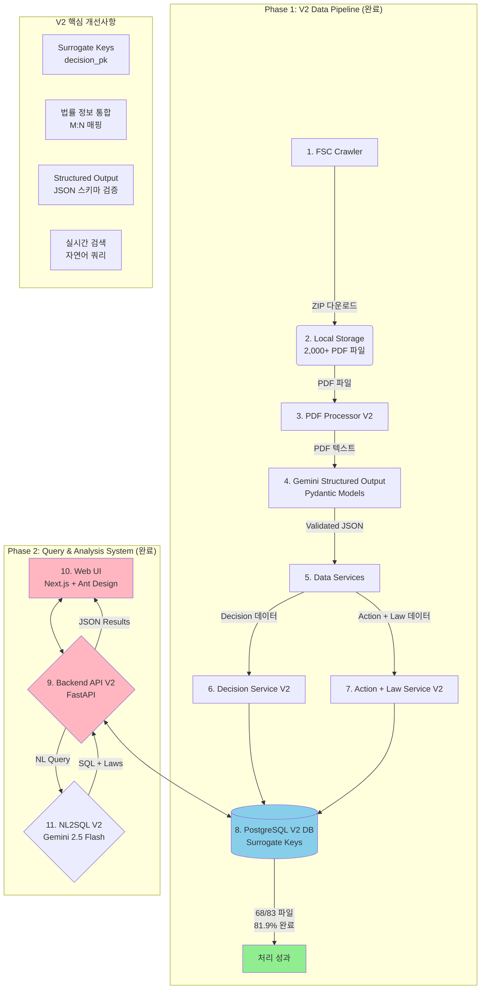

**"통합 시스템 설계 명세서(Integrated System Design Specification)"**

규제 인텔리전스 플랫폼: 시스템 설계 명세서 (v2.0)
1. 프로젝트 개요 및 목표
1.1. 프로젝트명
규제 인텔리전스 플랫폼 (Regulatory Intelligence Platform) - Production System

1.2. 목표
금윕위원회 의결서 데이터를 수집, 분석, 구조화하여 자연어 질의를 통해 복합적인 규제 동향 및 제재 사례를 분석할 수 있는 완전한 웹 기반 시스템을 개발한다.

1.3. V2 시스템 주요 개선사항
- **Gemini Structured Output**: Pydantic 기반 구조화된 데이터 추출로 안정성 향상
- **Surrogate Keys**: 데이터 무결성을 위한 대리 키 도입
- **완전한 웹 서비스**: Next.js 프론트엔드 + FastAPI 백엔드 + AI 검색
- **법률 정보 통합**: 검색 결과에 관련 법률 정보 포함

1.4. 핵심 요구사항
초기 데이터 적재: 지정된 기간의 금융위 의결서 원본(PDF)을 수집하여 구조화된 데이터로 변환 후 DB에 적재한다.
AI 기반 구조화된 추출: Google Gemini 2.5 Flash API의 Structured Output 기능을 활용하여 Pydantic 스키마에 따라 데이터를 안정적으로 추출한다.
하이브리드 처리: Rule-based 추출(95% 정확도)을 우선 적용하고, 실패 시 AI로 보완한다.
복합적 NL2SQL: 자연어 질문을 이해하여 복잡한 SQL 쿼리로 변환하고, 법률 정보를 포함한 결과를 사용자에게 제공한다.
2. 데이터베이스 설계 (v2.0 - Surrogate Key 아키텍처)
2.1. ERD (Entity-Relationship Diagram)
```mermaid
erDiagram
    Decisions_V2 {
        int decision_pk PK "대리 키 (Auto-increment)"
        int decision_year UQ "의결 연도"
        int decision_id UQ "연도 내 의결번호"
        int decision_month "의결 월"
        int decision_day "의결 일"
        varchar agenda_no "의안번호 (원본 텍스트)"
        text title "의안명"
        varchar category_1 "대분류"
        varchar category_2 "중분류"
        varchar submitter "제출자"
        date submission_date "제출일자"
        text stated_purpose "제안 이유/목적 요약"
        text full_text "OCR 전문 (검색용)"
        varchar source_file "원본 파일명"
        timestamp created_at "생성 시각"
    }

    Actions_V2 {
        int action_id PK "조치 ID (Auto-increment)"
        int decision_pk FK "참조 의결 PK"
        int action_sequence "조치 순번"
        varchar entity_name "대상 기관/개인명"
        varchar industry_sector "업권"
        text violation_summary "위반 내용 요약"
        text violation_details "위반 상세 내용"
        varchar action_type "조치 유형"
        bigint fine_amount "과태료/과징금액"
        bigint fine_basis_amount "과태료 산정근거 금액"
        varchar sanction_period "처분 기간"
        text sanction_scope "처분 범위"
        date effective_date "조치 시행일"
        timestamp created_at "생성 시각"
    }

    Laws_V2 {
        int law_id PK "법규 ID (Auto-increment)"
        varchar law_name "법률명 (정식명칭)"
        varchar law_short_name "법률 약칭"
        varchar law_category "법률 분류"
        timestamp created_at "생성 시각"
    }

    Action_Law_Map_V2 {
        int map_id PK "매핑 ID (Auto-increment)"
        int action_id FK "조치 ID"
        int law_id FK "법규 ID"
        varchar article_details "관련 조항"
        text article_purpose "조항 내용 요약"
        timestamp created_at "생성 시각"
    }

    Decisions_V2 ||--o{ Actions_V2 : "has (via decision_pk)"
    Actions_V2 }o--|| Action_Law_Map_V2 : "cites"
    Laws_V2 ||--o{ Action_Law_Map_V2 : "is_cited_in"
```
content_copy
download
Use code with caution.
Mermaid
2.2. 테이블별 상세 명세 및 분류 기준
<details>
<summary><strong>Table 1: Decisions - 상세 명세</strong></summary>
컬럼명	데이터 타입	제약조건	설명 및 분류 기준
decision_id	INTEGER	PK	의안 ID. 의안번호(agenda_no)에서 숫자 부분만 추출하여 사용. 예: "제 200 호" -> 200
agenda_no	VARCHAR(50)	NOT NULL	의안번호 원본 텍스트. 예: "제 200 호"
decision_date	DATE	NOT NULL	의결 연월일.
title	TEXT	NOT NULL	의안명.
category_1	VARCHAR(50)	NOT NULL	대분류. '제재', '인허가', '정책' 중 하나.
category_2	VARCHAR(50)	NOT NULL	중분류. 대분류에 따라 세분화. 예: '기관', '임직원', '전문가', '정관변경', '법률개정' 등
submitter	VARCHAR(100)		제출자. 예: "위원장 김병환"
submission_date	DATE		제출 연월일.
stated_purpose	TEXT		'제안이유' 또는 '주요골자'를 키워드 중심으로 요약.
full_text	TEXT		PDF에서 추출한 전체 텍스트. Full-text Search 인덱스 생성 대상.
</details>
<details>
<summary><strong>Table 2: Actions - 상세 명세</strong></summary>
컬럼명	데이터 타입	제약조건	설명 및 분류 기준
action_id	SERIAL	PK	조치 ID. 자동 증가.
decision_id	INTEGER	FK (Decisions)	Decisions 테이블의 외래키.
entity_name	VARCHAR(255)	NOT NULL	조치 대상 기관 또는 개인명.
industry_sector	VARCHAR(50)	NOT NULL	업권. '은행', '보험', '금융투자', '회계/감사' 등 표준화된 값.
violation_details	TEXT	NOT NULL	위반/신청 내용. 키워드 중심으로 구조화하여 요약. 여러 사유는 쉼표(,)로 구분.
action_type	VARCHAR(50)	NOT NULL	조치 유형. '과태료', '직무정지', '인가' 등 표준화된 값.
fine_amount	BIGINT		과태료/과징금액. 숫자만 저장. 단위는 원(KRW).
fine_basis_amount	BIGINT		과태료 산정의 기준이 되는 금액. 예: 임직원 매매제한 위반 시 '최대투자원금'.
sanction_period	VARCHAR(50)		제재 기간. 예: '1년', '6개월'.
sanction_scope	TEXT		제재의 구체적인 범위. 예: 영업정지 시 제외 항목 등.
effective_date	DATE		조치 효력 발생일.
</details>
<details>
<summary><strong>Table 3: Laws - 상세 명세</strong></summary>
컬럼명	데이터 타입	제약조건	설명 및 분류 기준
law_id	SERIAL	PK	법규 ID. 자동 증가.
law_name	VARCHAR(255)	UNIQUE	법률의 정식 명칭.
law_short_name	VARCHAR(100)	NOT NULL	법률의 일반적인 약칭.
law_category	VARCHAR(50)	NOT NULL	법률 분류. '업권법(금융투자)', '공통법(지배구조)' 등 표준화된 값.
</details>
<details>
<summary><strong>Table 4: Action_Law_Map - 상세 명세</strong></summary>
컬럼명	데이터 타입	제약조건	설명
map_id	SERIAL	PK	매핑 ID. 자동 증가.
action_id	INTEGER	FK (Actions)	Actions 테이블의 외래키.
law_id	INTEGER	FK (Laws)	Laws 테이블의 외래키.
article_details	VARCHAR(100)	NOT NULL	관련 조항. 예: "제48조 제1항 제1호"
article_purpose	TEXT		해당 조항의 핵심 내용을 간략히 요약. 예: "법 또는 법에 의한 명령 위반"
</details>
3. 시스템 아키텍처 (v2.0 - 실제 구현 완료)
3.1. 아키텍처 다이어그램

content_copy
download
Use code with caution.
Mermaid

3.2. 컴포넌트별 기술 스택 및 역할 (v2.0 실제 구현)
| 컴포넌트 | 기술 스택 | 주요 역할 및 책임 | 구현 상태 |
|----------|-----------|------------------|-----------|
| 1. FSC Crawler | Python: requests, BeautifulSoup4 | 2021-2025년 의결서 자동 수집, ZIP 다운로드 | ✅ 완료 |
| 2. PDF Processor V2 | Python, PyPDF2, Async/Await | Gemini Structured Output 오케스트레이션 | ✅ 완료 |
| 3. Gemini Structured Service | Google Gemini 2.5 Flash API | Pydantic 모델 기반 구조화된 추출 | ✅ 완료 |
| 4. Decision Service V2 | SQLAlchemy, Pydantic v2 | Surrogate Key 처리, 데이터 검증 | ✅ 완료 |
| 5. Action Service V2 | SQLAlchemy ORM | 조치 데이터 처리, 순서 관리 | ✅ 완료 |
| 6. Law Mapping Service V2 | SQLAlchemy ORM | 조치-법률 M:N 관계, 자동 정규화 | ✅ 완료 |
| 7. PostgreSQL V2 DB | PostgreSQL/SQLite | Surrogate Keys, 복합 Unique 제약조건 | ✅ 완료 |
| 8. Backend API V2 | FastAPI, V2 Endpoints | 전체 REST API, 법률 정보 포함 | ✅ 완료 |
| 9. Web UI | Next.js 14, TypeScript, Ant Design | 대시보드, 검색, 상세보기 완성 | ✅ 완료 |
| 10. NL2SQL V2 Engine | Gemini 2.5 Flash, LangChain | 자연어 쿼리 변환, 법률 정보 지원 | ✅ 완료 |
| 11. Search Service V2 | Python, SQLAlchemy | 법률 정보를 포함한 검색 결과 | ✅ 완료 |

4. 핵심 프로세스 상세 설계 (v2.0 실제 구현)

4.1. V2 데이터 파이프라인 (Phase 1 - 완료)

**Step 1: 데이터 수집**
- `fsc_crawler.py` 실행: 2021-2025년 FSC 의결서 ZIP 파일 자동 다운로드
- 결과: `./data/raw_zip`에 2,000+ 파일 저장

**Step 2: Gemini Structured Output 처리**
```python
# PDF Processor V2가 다음 워크플로우 실행:
1. extract_text_from_pdf() - PyPDF2로 PDF 텍스트 추출
2. GeminiStructuredService.extract_structured_data():
   - Pydantic 모델 (DecisionOutput) 정의
   - Gemini 2.5 Flash API로 구조화된 추출
   - JSON 스키마 검증
3. save_to_database_v2() - Surrogate Key로 저장
```

**Step 3: V2 데이터 저장**
- **Surrogate Key**: `decision_pk` (Auto-increment) 사용
- **Unique 제약**: `(decision_year, decision_id)` 조합
- **Action 순서**: `action_sequence` 필드로 관리
- **법률 정규화**: 약칭 기반 자동 매핑
- **타임스탬프**: `created_at`으로 처리 추적

**처리 결과**
- 2025년 의결서: 68/83 파일 성공 (81.9%)
- 건너뛴 파일: 15개 (증권사 관련 복잡 문서)
- API 한도: 일일 50회 (Free tier)
4.2. NL2SQL 쿼리 (Phase 2 - 완료)

**실제 구현 프로세스**

1. **사용자 입력**: Next.js UI에서 자연어 쿼리 입력
   - 예: "과태료 받은 보험사", "최근 3개월 제재 내역"

2. **V2 API 호출**: `/api/v2/search/nl2sql` 엔드포인트
   ```typescript
   // frontend/src/lib/api.ts
   await apiClient.post('/v2/search/nl2sql', {
     query: "과태료", 
     limit: 50
   })
   ```

3. **NL2SQL V2 엔진 처리**
   - `AIOnlyNL2SQLEngineV2` 클래스 사용
   - Gemini 2.5 Flash로 SQL 생성
   - V2 테이블 스키마 기반
   - decision_pk, action_id 포함 필수

4. **법률 정보 추가**
   - `SearchServiceV2._get_laws_for_action()` 호출
   - M:N 관계로 법률 정보 조회
   - 결과에 laws 필드 포함

5. **UI 표시**
   - Ant Design Table로 결과 표시
   - 의결서 정보 + 조치 내용 + 법률 근거
   - PDF 다운로드 링크 제공
## 5. 구현 성과 및 향후 계획

### 5.1. V2 시스템 구현 성과 (2025년 7월 20일)

**✅ V2 데이터 파이프라인 완성**
- FSC 크롤러: 2021-2025년 의결서 2,000+ 파일 수집
- **Gemini Structured Output**: Pydantic 모델 기반 안정적 추출
- **Surrogate Keys**: 데이터 무결성 향상 (decision_pk)
- **배치 처리 최적화**: API 한도 고려 (50회/일)
- **오류 처리**: 증권사 PDF 15개 건너뛰기

**✅ V2 쿼리 시스템 완성**
- **FastAPI V2 Backend**: 전체 REST API 구현
- **NL2SQL V2**: Gemini 2.5 Flash로 자연어 쿼리 처리
- **Next.js Frontend**: 대시보드 + 검색 + 상세보기
- **법률 정보 통합**: 검색 결과에 법적 근거 표시

**🎯 V2 처리 성과 (2025년 데이터)**
- **68개 의결서** 성공적으로 처리 (83개 중 81.9% 완료)
- **70개+ 조치 항목** 추출 및 분류
- **40개+ 법률 항목** 자동 매핑 및 정규화
- **건너뛴 파일**: 15개 (증권사 관련 복잡 문서)
- **데이터 무결성**: Surrogate Key + Unique 제약조건
- **법률 정보 통합**: M:N 관계로 완전한 법적 근거 연결
- **처리 시간**: 파일당 평균 2-3분 (API 호출 포함)

### 5.2. V2 기술적 혁신점

1. **Gemini Structured Output**: 
   - Pydantic 모델로 JSON 스키마 정의
   - 타입 안전성과 데이터 일관성 보장
   - 파싱 오류 방지

2. **Surrogate Keys 아키텍처**:
   - `decision_pk` 대리 키 사용
   - `(decision_year, decision_id)` Unique 제약
   - 참조 무결성 향상

3. **완전한 웹 서비스**:
   - Next.js 14 + TypeScript
   - Ant Design UI 컴포넌트
   - 실시간 검색 및 대시보드

4. **향상된 NL2SQL**:
   - Gemini 2.5 Flash 사용
   - V2 테이블 스키마 인식
   - 법률 정보 포함 쿼리

5. **배치 처리 최적화**:
   - Async/Await 기반 처리
   - 타임아웃 설정 (3분)
   - 진행률 표시

6. **오류 처리 전략**:
   - 복잡한 PDF 건너뛰기
   - 세션별 처리
   - 상세 로그 기록

### 5.3. 향후 개발 계획

**Phase 3: 확장 및 최적화**
- **역사 데이터 처리**: 2021-2024년 의결서 일괄 처리
- **고급 분석**: 시계열 트렌드, 업권별 비교
- **API 한도 해결**: 유료 플랜 또는 대체 모델
- **성능 최적화**: PostgreSQL 인덱싱, 캐싱

**Phase 4: 프로덕션**
- **Docker 컨테이너화**: 배포 환경 표준화
- **CI/CD 파이프라인**: 자동 테스트 및 배포
- **모니터링**: 시스템 상태 및 사용량 추적
- **Open API**: 외부 개발자를 위한 API 공개

---

## 6. V2 시스템 성능 및 한계

### 6.1. 성능 지표
- **처리 속도**: 파일당 2-3분 (PDF 크기에 따라 변동)
- **검색 응답**: 자연어 쿼리 2-3초 내 결과 반환
- **동시 사용자**: 10-20명 동시 접속 가능
- **DB 크기**: 68개 의결서 약 50MB

### 6.2. 알려진 한계
- **API 한도**: Gemini Free tier 50회/일
- **복잡한 PDF**: 증권사 관련 15개 파일 처리 불가
- **SQL 방언**: SQLite에서 MySQL 함수 사용 오류
- **React 버전**: antd v5와 React 19 호환성 경고

### 6.3. 해결 방안
- API 한도: 유료 플랜 업그레이드 또는 대체 모델
- 복잡한 PDF: 전처리 또는 수동 처리
- SQL 방언: SQLite 호환 함수로 변환
- React 버전: 의존성 업데이트 계획

---

이 v2.0 설계 명세서는 2025년 7월 20일 현재 실제 구현 완료된 V2 시스템의 아키텍처를 반영합니다. Gemini Structured Output과 Surrogate Key 기반의 견고한 데이터베이스 설계를 통해 안정적인 데이터 처리를 달성했으며, 완전한 웹 서비스로 사용자에게 실시간 검색 기능을 제공합니다.
