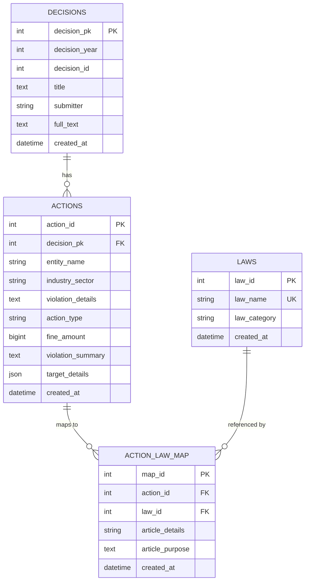

# 프로젝트 리팩토링 가이드: 금융위원회 제재 정보 추출 및 관리 시스템

## 1. 프로젝트 개요

본 프로젝트는 금융위원회의 '의결서' PDF 파일들로부터 제재 관련 데이터를 지능적으로 추출, 정형화하여 관계형 데이터베이스(DB)에 저장하는 파이프라인을 구축하는 것을 목표로 합니다.

기존 시스템은 반정형 텍스트에서 데이터를 추출하는 과정에서 안정성 및 확장성에 한계가 있었습니다. 이번 리팩토링을 통해 Google의 Gemini 1.5 Flash 모델과 **Structured Output** 기능을 도입하여, 데이터 처리 파이프라인을 현대적이고 안정적으로 전면 재설계합니다.

**핵심 목표:** 비정형 문서(PDF)를 신뢰할 수 있는 구조화된 데이터 자산(DB)으로 자동 변환하는 완전한 End-to-End 시스템 구축

## 2. 리팩토링의 목적

- **안정성 및 신뢰성 향상:** LLM의 응답 형식이 깨지거나 누락되는 문제를 원천적으로 차단하여 데이터 추출 실패율을 최소화합니다.
- **개발 및 유지보수 효율 증대:** 복잡한 후처리 및 데이터 검증 로직을 단순화하고, 스키마 기반의 개발을 통해 코드의 가독성과 유지보수성을 높입니다.
- **확장성 확보:** 향후 새로운 데이터 필드가 추가되거나 스키마가 변경될 때, Pydantic 모델 정의만 수정하여 쉽게 대응할 수 있는 유연한 구조를 만듭니다.

## 3. 제안 아키텍처 (To-Be)

새로운 시스템은 아래와 같이 명확하게 구분된 3단계 파이프라인으로 구성됩니다.

```mermaid
flowchart TD
    A[📄 PDF 의결서 파일] --> B{1. 전처리 모듈 (Preprocessing)};
    B --> C[🧹 정제된 텍스트];
    C --> D{2. 데이터 추출 모듈 (Extraction)};
    D -- Gemini 1.5 Flash API & Structured Output --> E[🐍 구조화된 Python 객체];
    E --> F{3. 후처리 및 저장 모듈 (Post-processing & Persistence)};
    F -- DB Transaction --> G[💾 데이터베이스];

    subgraph "핵심 로직"
        D
        F
    end
```

### 3.1. 1단계: 전처리 (Preprocessing)

- **역할:** PDF 파일에서 Gemini가 가장 잘 이해할 수 있는 고품질의 텍스트를 추출하고 정제합니다.
- **세부 작업:**
    1.  PDF 파일로부터 텍스트를 추출합니다. (PyMuPDF, PDFPlumber 등의 라이브러리 활용)
    2.  텍스트 내 표(Table) 구조가 손실되지 않도록 마크다운(Markdown) 형식으로 변환하는 로직을 구현합니다.
    3.  불필요한 머리글, 바닥글, 페이지 번호 등을 제거하여 노이즈를 줄입니다.

### 3.2. 2단계: 데이터 추출 (Extraction with Gemini Structured Output)

- **역할:** 정제된 텍스트를 Gemini API에 전달하고, **Structured Output** 기능을 사용하여 우리가 정의한 스키마를 완벽하게 따르는 Python 객체를 반환받습니다.
- **핵심 기술:** Pydantic 모델을 사용해 DB 스키마를 Python 클래스로 정의하고, 이를 Gemini API의 `response_schema`로 지정합니다.
- **Pydantic 데이터 모델 (`data_models.py`):**
    ```python
    from pydantic import BaseModel, Field
    from typing import List, Optional, Dict, Any
    from datetime import date, datetime

    # M:N 관계를 위한 중간 테이블 모델
    class ActionLawMap(BaseModel):
        law_name: str = Field(description="관련 법규의 전체 이름 (예: 자본시장과 금융투자업에 관한 법률)")
        article_details: str = Field(description="관련 법 조항 (예: 제85조 제8호)")
        article_purpose: Optional[str] = Field(None, description="해당 조항의 목적 또는 내용 요약")

    # 조치(Action) 모델
    class Action(BaseModel):
        entity_name: str = Field(description="제재 대상이 되는 기관명 또는 개인의 이름 (예: 타이거자산운용, 대표이사 甲)")
        industry_sector: Optional[str] = Field(None, description="대상 기관의 산업 분야 (예: 자산운용)")
        violation_details: Optional[str] = Field(None, description="위반 내용에 대한 상세 설명")
        action_type: str = Field(description="제재/조치의 종류 (예: 과태료, 직무정지, 기관경고). 여러 개일 경우 쉼표로 구분")
        fine_amount: Optional[int] = Field(None, description="과태료 또는 과징금 금액. '백만원' 단위를 숫자로 변환 (예: 100백만원 -> 100000000)")
        violation_summary: str = Field(description="AI가 요약한 핵심 위반 내용")
        target_details: Optional[Dict[str, Any]] = Field(None, description="제재 대상에 대한 추가 정보 (예: {'type': '임직원', 'position': '대표이사'})")
        action_law_map: List[ActionLawMap] = Field(description="해당 조치와 관련된 법규 목록")

    # 최상위 의결서(Decision) 모델
    class Decision(BaseModel):
        decision_year: int = Field(description="의결서의 연도 (예: 2025)")
        decision_id: int = Field(description="의결서의 호(ID) (예: 1)")
        title: str = Field(description="의결서의 전체 제목")
        submitter: Optional[str] = Field(None, description="의안 제출자 (예: 금융감독원)")
        full_text: str = Field(description="OCR로 추출한 의결서 원문 전체")
        actions: List[Action] = Field(description="의결서에 포함된 모든 조치 사항 목록")

    ```

### 3.3. 3단계: 후처리 및 저장 (Post-processing & Persistence)

- **역할:** Gemini로부터 받은 구조화된 객체를 비즈니스 로직에 따라 최종 검증하고, 데이터베이스 트랜잭션을 통해 안전하게 저장합니다.
- **세부 작업:**
    1.  **비즈니스 로직 검증:**
        -   `ActionLawMap`의 `law_name`이 `LAWS` 테이블에 존재하는지 확인합니다.
        -   존재하지 않는 법규명일 경우, `LAWS` 테이블에 새로 추가(INSERT)하고 생성된 `law_id`를 사용합니다.
    2.  **데이터베이스 트랜잭션:**
        -   하나의 `Decision` 객체에서 파생된 모든 데이터(`DECISIONS`, `ACTIONS`, `ACTION_LAW_MAP` 테이블에 들어갈 데이터)를 단일 트랜잭션으로 묶어 처리합니다.
        -   저장 과정에서 오류 발생 시, 트랜잭션 전체를 롤백하여 데이터 정합성을 보장합니다.

## 4. 데이터베이스 스키마 (ERD)


*참고: 리팩토링 시, 위 ERD의 `DECISIONS` 테이블 복합키는 단일 `decision_pk` (Surrogate Key)로 변경하고, `(decision_year, decision_id)`는 UNIQUE 제약조건으로 유지하는 것을 권장합니다.*

## 5. 리팩토링 실행 계획 (Action Plan)

아래의 Task 순서대로 리팩토링을 진행합니다.

1.  **Task 1: 환경 설정 및 라이브러리 설치**
    -   `requirements.txt` 파일을 생성하고 필요한 라이브러리(google-generativeai, pydantic, sqlalchemy, PyMuPDF 등)를 명시합니다.

2.  **Task 2: 데이터 모델 정의 (`data_models.py`)**
    -   `3.2.` 섹션에 명시된 Pydantic 모델(`ActionLawMap`, `Action`, `Decision`)을 코드로 구현합니다.

3.  **Task 3: 전처리 모듈 구현 (`preprocessing.py`)**
    -   PDF 파일 경로를 입력받아 정제된 텍스트를 반환하는 함수를 작성합니다.
    -   (심화) 테이블 인식 및 마크다운 변환 로직을 포함합니다.

4.  **Task 4: Gemini 추출 서비스 구현 (`extraction_service.py`)**
    -   정제된 텍스트와 Pydantic 스키마(`Decision`)를 입력받아 Gemini API의 Structured Output 기능을 호출하는 클래스 또는 함수를 작성합니다.
    -   API 호출 성공 시, Pydantic으로 자동 파싱된 `Decision` 객체를 반환합니다.
    -   API 키 등 민감 정보는 환경 변수 또는 별도의 설정 파일로 관리합니다.

5.  **Task 5: DB 저장 모듈 구현 (`persistence_service.py`)**
    -   `Decision` 객체를 입력받아, 내부 로직에 따라 각 DB 테이블(`DECISIONS`, `ACTIONS`, `LAWS`, `ACTION_LAW_MAP`)에 데이터를 저장하는 함수를 작성합니다.
    -   SQLAlchemy와 같은 ORM을 사용하여 DB 작업을 수행하고, 전체 프로세스를 단일 트랜잭션으로 관리합니다.

6.  **Task 6: 메인 파이프라인 오케스트레이터 (`main.py`)**
    -   전체 프로세스를 총괄하는 메인 스크립트를 작성합니다.
    -   `PDF 파일 경로` -> `[전처리]` -> `[추출]` -> `[저장]`의 흐름을 순차적으로 호출합니다.

7.  **Task 7: 로깅 및 예외 처리 강화**
    -   파이프라인의 각 단계에서 발생하는 상황과 오류를 추적할 수 있도록 표준 로깅(logging)을 적용합니다.
    -   단계별로 발생할 수 있는 예외 상황(파일 없음, API 오류, DB 연결 실패 등)에 대한 명확한 처리 로직을 추가합니다.

---